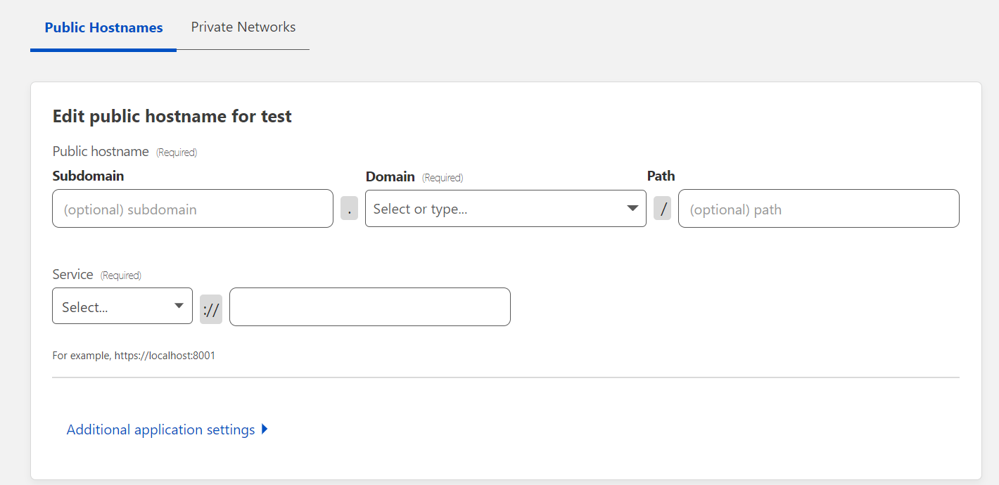
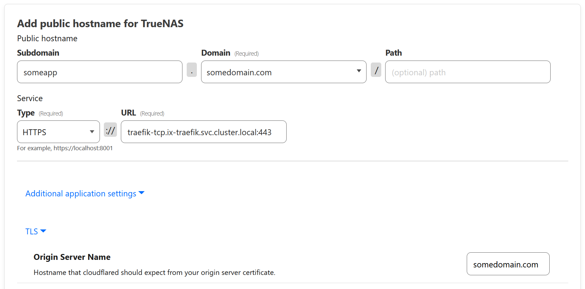

:::danger[Cloudflared Tunnels for Plex, Jellyfin, Emby and other video heavy/streaming apps/sites]

Using Cloudflare Tunnels with video streaming or sharing sites goes against the Cloudflare ToS, see full terms on the [Cloudflare Website](https://www.cloudflare.com/service-specific-terms-application-services/#content-delivery-network-terms)

Content Delivery Network (Free, Pro, or Business) (Current on 2024-03-14)
Cloudflare’s content delivery network (the “CDN”) Service can be used to cache and serve web pages and websites. Unless you are an premium customer, Cloudflare offers specific Paid Services (e.g., the Developer Platform, Images, and Stream) that you must use in order to serve video and other large files via the CDN. Cloudflare reserves the right to disable or limit your access to or use of the CDN, or to limit your End Users’ access to certain of your resources through the CDN, if you use or are suspected of using the CDN without such Paid Services to serve video or a disproportionate percentage of pictures, audio files, or other large files. We will use reasonable efforts to provide you with notice of such action.

:::

## Cloudflared Tunnel Creation

- Go to [cloudflare team dash](https://dash.teams.cloudflare.com) and create a tunnel or migrate a current tunnel (this action is not reversible) by going to access and then tunnels tab.

- Create a tunnel like so (or migrate a current one)

- Copy **JUST** the token from tunnel's overview **Install and run a connector** section.

- Set the `token` with **your** tunnel's token. the tunnel ID will **NOT** work.
- Now you can manage the tunnel via cloudflare dash by setting a private network or create ingress rules for your services and domain, explained in [Setting up individial apps](#setting-up-individual-apps)

:::notes

- You MAY need to modify cloudflared Zero Trust various settings in order for this work out-of-the-box which is beyond the scope of this guide.

- You can use this as a reverse proxy directly or use it in conjunction with traefik if you are behind a CGNAT, do not have a static IP, or can not port forward 443 (SSL).

:::

## Setting up individual apps

### Using traefik

If you've set up your apps with traefik, you need to set up two public hostnames

- Set `subdomain` to a sub domain (can be left blank to use the root domain)
- Set `domain` to your domain
- Set `type` to `HTTPS`
- Set `URL` to your traefik URL, usually `traefik-tcp.ix-traefik.svc.cluster.local:443` (make sure the port is the same as the port you specified in traefik config)
- Under `Additional app settings` > `TLS`, set `Origin Server Name` to your domain (This needs to **match** what you have set for the sub and root domain; ex `someapp.somedomain.com`).

Then you need to do the same to set up the subdomain for each app you want to expose, using the same subdomain you specified in the app's ingress settings as follows:

:::danger[No TLS Verify]

Please refrain from enabling the "No TLS Verify" option, as doing so will disable TLS verification, thereby allowing any certificate from the origin to be accepted. This option removes certificate security validation, rendering the certificates meaningless for security.

:::

### Without traefik

If you've not set up traefik and ingress, and exposing the ports using the normal loadbalancer, you only need to set up each app individually, and set `URL` to `<TrueNAS Local IP>:<PORT of app>` or cluster app url for each app.
